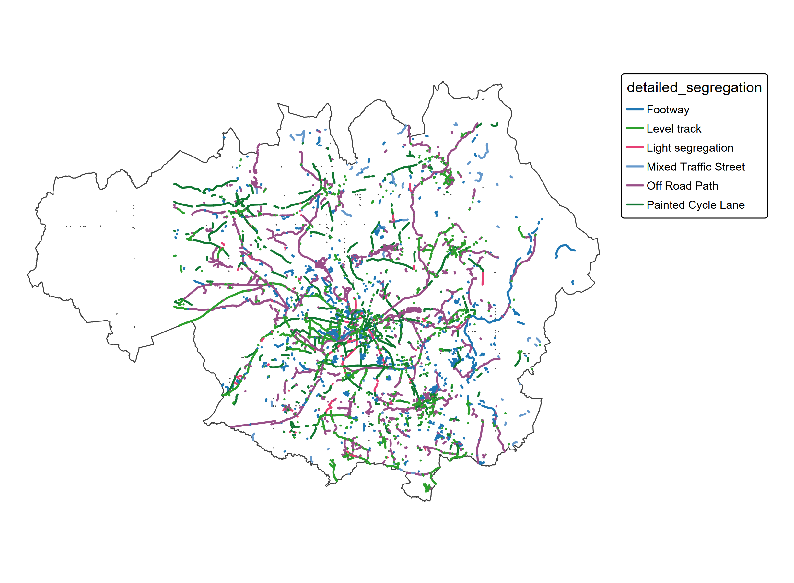

# Manchester Cycling collision data analysis

# Introduction

In 2019 Manchester began to build a joined up network of segregated
cycle paths as part of the ‘Bee Network’.

Recently the R package \[osmactive\]
(https://github.com/nptscot/osmactive/) was released as part of work by
npt. This allows the data that is in osm to be better interogated for
cycle network information.

The osm street network for Manchester was imported and functions from
osmactive applied creating a column called ‘detailed segregation’, which
defines the type of cycle path present, shown below.

From studying this map and matching with local knowledge it appears that
the new infrastructure mostly falls under the category ‘Level track’ and
‘Light segregation’.

The stats19 data was imported and filtered for two periods 2014-2018
(prior to the ‘Bee Network’) and 2019 - 2023. This is a loose date range
as many parts of the network were only finished in recent yers.

In attempt to summarise the data H3 syste was used.

Hexegons with the cycle infrastructure ‘Level track’ and ‘Light
segregation’ were seperated from the rest of the region.

The total casualties for each hexegon for the whole region were
calculated for the two periods. Period 1 2014-2018

and period 2 2019-2023. The hexegons estimated to have the recent cycle
infrastructure are outlined with a thicker line.

Subtracting p1 from p2 gives the difference for the two periods

On average the hexegons with ‘Level track’ annd ‘Light segregation’ have
had a reduction of 0.3 casualties and areas without 0.1 casualty
reduction in the second period.
